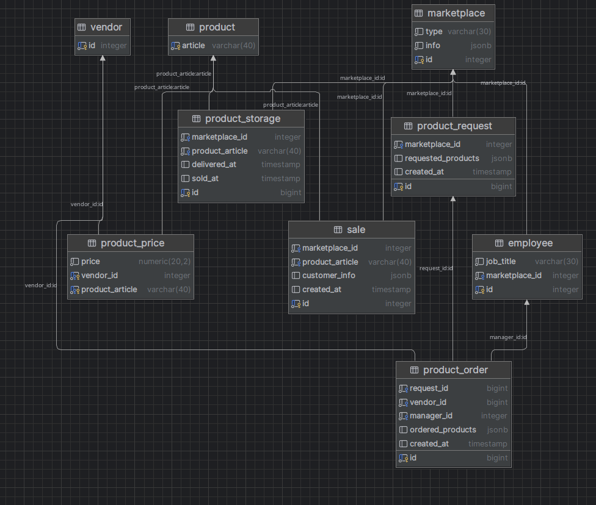

## Общая схема связей

__Таблица marketplace__

| Поле  | Описание                                             | 
|-------|------------------------------------------------------| 
| id    | Уникальный идентификатор (SERIAL)                    | 
| mtype | Тип маркетплейса (VARCHAR(30), NOT NULL)             | 
| info  | Дополнительная информация в формате JSONB (NOT NULL) |

---

__Таблица vendor__

| Поле | Описание                          | 
|------|-----------------------------------| 
| id   | Уникальный идентификатор (SERIAL) |

---

__Таблица product__

| Поле    | Описание                                    | 
|---------|---------------------------------------------| 
| article | Артикул продукта (VARCHAR(40), PRIMARY KEY) |

---

__Таблица employee__

| Поле           | Описание                                       | 
|----------------|------------------------------------------------| 
| id             | Уникальный идентификатор (SERIAL)              | 
| job_title      | Должность сотрудника (VARCHAR(30), NOT NULL)   | 
| marketplace_id | Идентификатор маркетплейса (INTEGER, NOT NULL) |

---

__Таблица product_order__

| Поле               | Описание                                                 | 
|--------------------|----------------------------------------------------------| 
| id                 | Уникальный идентификатор заказа (BIGSERIAL, PRIMARY KEY) | 
| status             | Статус заказа (VARCHAR(20), NOT NULL)                    | 
| vendor_id          | Идентификатор поставщика (INTEGER)                       | 
| marketplace_id     | Идентификатор маркетплейса (INTEGER, NOT NULL)           | 
| manager_id         | Идентификатор менеджера (INTEGER)                        | 
| requested_products | Запрашиваемые продукты в формате JSONB                   | 
| ordered_products   | Заказанные продукты в формате JSONB                      | 
| requested_at       | Дата и время запроса (TIMESTAMP)                         | 
| ordered_at         | Дата и время заказа (TIMESTAMP)                          |

- __status__ принимает три значения:
  - __REQUESTED__ - маркетплейс заказал товары
  - __ORDERED__ - менеджер подтвердил заказ, уточнил количество товара и выбрал поставщика
  - __DONE__ - заказ выполнен

---

__Таблица sale__

| Поле            | Описание                                                 | 
|-----------------|----------------------------------------------------------| 
| id              | Уникальный идентификатор продажи (SERIAL, PRIMARY KEY)   | 
| marketplace_id  | Идентификатор маркетплейса (INTEGER, NOT NULL)           | 
| product_article | Артикул продукта (VARCHAR(40), NOT NULL)                 | 
| customer_info   | Информация о клиенте в формате JSONB                     | 
| created_at      | Дата и время создания продажи (TIMESTAMP, DEFAULT NOW()) |

---

__Таблица product_price__

| Поле            | Описание                                     | 
|-----------------|----------------------------------------------| 
| vendor_id       | Идентификатор поставщика (INTEGER, NOT NULL) | 
| product_article | Артикул продукта (VARCHAR(40), NOT NULL)     | 
| price           | Цена продукта (NUMERIC(20, 4), NOT NULL)     |

---

__Таблица product_storage__

| Поле            | Описание                                                   | 
|-----------------|------------------------------------------------------------| 
| id              | Уникальный идентификатор хранения (BIGSERIAL, PRIMARY KEY) | 
| marketplace_id  | Идентификатор маркетплейса (INTEGER, NOT NULL)             | 
| product_article | Артикул продукта (VARCHAR(40), NOT NULL)                   | 
| delivered_at    | Дата и время доставки (TIMESTAMP)                          | 
| sold_at         | Дата и время продажи (TIMESTAMP)                           |

---
