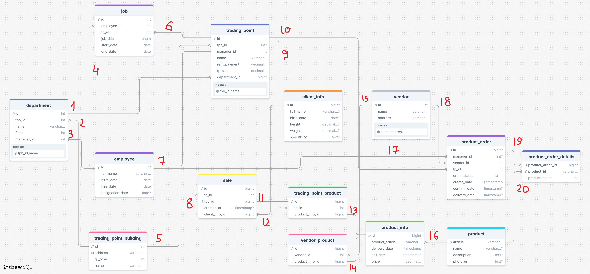

# Отчёт о выполнении Задания 1

## Сущности

| №  | Имя таблицы            | Описание                            |                                             
|----|------------------------|-------------------------------------|
| 1  | trading_point_building | Здание торговой организации         |                                             
| 2  | employee               | Сотрудники                          |                                             
| 3  | trading_point          | Торговая точка (ТТ)                 |                                             
| 4  | department             | Секции универмагов                  |                                             
| 6  | product                | Товары                              |                                             
| 7  | product_supply         | Информация о поставках товаров      |                                             
| 8  | trading_point_product  | Товары, доступные в торговых точках |                                             
| 9  | sale                   | Продажи товаров                     |                                            
| 10 | client_info            | Информации о клиентах               |                                             
| 12 | vendor                 | Поставщики                          |                                             
| 13 | vendor_product         | Товары, доступные у поставщиков     |                                             
| 14 | product_order          | Заказы товаров у поставщика         |                                             
| 15 | product_order_details  | Уточнения заказов                   |

## Сущности и атрибуты

### `trading_point_building`

| Атрибут | Описание                                                         |
|---------|------------------------------------------------------------------|
| id      | Уникальный идентификатор (первичный ключ).                       |
| address | Адрес торговой точки (уникальный).                               |
| tp_type | Тип торговой точки (ENUM: DEPARTMENT_STORE, SHOP, KIOSK, STALL). |
| name    | Название торговой точки.                                         |

### `employee`

| Атрибут          | Описание                                                                                                        |
|------------------|-----------------------------------------------------------------------------------------------------------------|
| id               | Уникальный идентификатор (первичный ключ).                                                                      |
| manager_id       | Идентификатор менеджера (внешний ключ на employee).                                                             |
| job_title        | Должность сотрудника (ENUM: MANAGER, SALESMAN, CASHIER, WAREHOUSE_WORKER, ACCOUNTANT, SECURITY_GUARD, CLEANER). |
| tp_id            | Идентификатор торговой точки (внешний ключ на trading_point).                                                   |
| full_name        | Полное имя сотрудника.                                                                                          |
| birth_date       | Дата рождения сотрудника.                                                                                       |
| hire_date        | Дата приема на работу.                                                                                          |
| resignation_date | Дата увольнения (может быть NULL).                                                                              |

### `trading_point`

| Атрибут       | Описание                                                                      |
|---------------|-------------------------------------------------------------------------------|
| id            | Уникальный идентификатор (первичный ключ).                                    |
| tpb_id        | Идентификатор здания торговой точки (внешний ключ на trading_point_building). |
| manager_id    | Идентификатор менеджера (внешний ключ на employee).                           |
| name          | Название торговой точки.                                                      |
| rent_payment  | Арендная плата.                                                               |
| tp_size       | Размер торговой точки.                                                        |
| department_id | Идентификатор секции универмага.                                              |

### `department`

| Атрибут    | Описание                                                                      |
|------------|-------------------------------------------------------------------------------|
| id         | Уникальный идентификатор (первичный ключ).                                    |
| tpb_id     | Идентификатор здания торговой точки (внешний ключ на trading_point_building). |
| name       | Название департамента.                                                        |
| floor      | Этаж, на котором расположен департамент.                                      |
| manager_id | Идентификатор менеджера (внешний ключ на employee).                           |

### `product`

| Атрибут     | Описание                           |
|-------------|------------------------------------|
| article     | Артикул продукта (первичный ключ). |
| name        | Название продукта.                 |
| description | Описание продукта.                 |
| photo_url   | URL фотографии продукта.           |

### `product_supply`

| Атрибут         | Описание                                    |
|-----------------|---------------------------------------------|
| id              | Уникальный идентификатор (первичный ключ).  |
| product_article | Артикул продукта (внешний ключ на product). |
| delivery_date   | Дата поставки.                              |
| sell_date       | Дата продажи (может быть NULL).             |
| price           | Цена продукта.                              |

### `trading_point_product`

| Атрибут           | Описание                                                          |
|-------------------|-------------------------------------------------------------------|
| id                | Уникальный идентификатор (первичный ключ).                        |
| tp_id             | Идентификатор торговой точки (внешний ключ на trading_point).     |
| product_supply_id | Идентификатор поставки продукта (внешний ключ на product_supply). |

### `sale`

| Атрибут        | Описание                                                                         |
|----------------|----------------------------------------------------------------------------------|
| id             | Уникальный идентификатор (первичный ключ).                                       |
| tp_id          | Идентификатор торговой точки (внешний ключ на trading_point).                    |
| tpp_id         | Идентификатор продукта в торговой точке (внешний ключ на trading_point_product). |
| created_at     | Дата и время создания продажи.                                                   |
| client_info_id | Идентификатор client_info                                                        |

### `client_info`

| Атрибут     | Описание                                       |
|-------------|------------------------------------------------|
| id          | Уникальный идентификатор (первичный ключ).     |
| full_name   | Полное имя клиента.                            |
| birth_date  | Дата рождения клиента.                         |
| height      | Рост клиента.                                  |
| weight      | Вес клиента.                                   |
| specificity | Специфика клиента (дополнительная информация). |

### `vendor`

| Атрибут | Описание                                   |
|---------|--------------------------------------------|
| id      | Уникальный идентификатор (первичный ключ). |
| name    | Название поставщика.                       |
| address | Адрес поставщика.                          |

### `vendor_product`

| Атрибут           | Описание                                                          |
|-------------------|-------------------------------------------------------------------|
| id                | Уникальный идентификатор (первичный ключ).                        |
| vendor_id         | Идентификатор поставщика (внешний ключ на vendor).                |
| product_supply_id | Идентификатор поставки продукта (внешний ключ на product_supply). |

### `product_order`

| Атрибут       | Описание                                                      |
|---------------|---------------------------------------------------------------|
| id            | Уникальный идентификатор (первичный ключ).                    |
| manager_id    | Идентификатор менеджера (внешний ключ на employee).           |
| vendor_id     | Идентификатор поставщика (внешний ключ на vendor).            |
| tp_id         | Идентификатор торговой точки (внешний ключ на trading_point). |
| order_status  | Статус заказа (ENUM: ORDERED, CONFIRMED, DELIVERED).          |
| create_date   | Дата создания заказа.                                         |
| confirm_date  | Дата подтверждения заказа (может быть NULL).                  |
| delivery_date | Дата доставки заказа (может быть NULL).                       |

### `product_order_details`

| Атрибут          | Описание                                                       |
|------------------|----------------------------------------------------------------|
| product_order_id | Идентификатор заказа продукта (внешний ключ на product_order). |
| product_id       | Артикул продукта (внешний ключ на product).                    |
| product_count    | Количество продукта в заказе.                                  |

## Сущности и связи

| №   | Связь | Описание                                                                          |
|-----|-------|-----------------------------------------------------------------------------------|
| R1  | 1:N   | Секция универмага может иметь несколько ТТ                                        |
| R2  | 1:N   | Универмаг может иметь несколько секций                                            |
| R3  | 1:N   | Один менеджер может руководить несколькими секциями                               |
| R4  | 1:N   | Один сотрудник может работать на разных должностях (**не одновременно**!)         |
| R5  | 1:N   | У одного здания может быть несколько ТТ (универмаг, магазин)                      |
| R6  | 1:N   | У одной ТТ может быть несколько сотрудников                                       |
| R7  | 1:1   | У ТТ может быть один менеджер, у одного менеджера может быть одна ТТ              |
| R8  | 1:N   | У ТТ может быть много продаж                                                      |
| R9  | 1:N   | У ТТ может быть много товаров                                                     |
| R10 | 1:N   | ТТ может создавать множество запросов на товары                                   |
| R11 | N:1   | Информация об одном клиенте может содержаться в нескольких покупках этого клиента |
| R12 | 1:N   | Одна продажа соотв. многим товарам (чек покупки)                                  |
| R13 | 1:N   | Одна информация о товаре соотв. одному товару                                     |
| R14 | 1:N   | Одна информация о товаре соотв. одному товару                                     |
| R15 | 1:N   | Производитель может иметь несколько товаров                                       |
| R16 | 1:N   | Одному продукту может соотв. несколько информаций о поставке/продаже              |
| R17 | 1:N   | Один менеджер может подтвердить несколько заказов                                 |
| R18 | 1:N   | Один поставщик может отправить несколько заказов                                  |
| R19 | 1:N   | Одному заказу может соотв. несколько деталей заказа                               |
| R20 | 1:N   | Одному товару может соотв. несколько деталей заказа                               |

## ER-диаграмма

[Ссылка на интерактивную диаграмму](https://drawsql.app/teams/you-6/diagrams/er-diagram)

## Переход от ER-диаграммы к реляционной схеме

[**SQL файл с созданием таблиц**](../../database/scripts/migrations/V0001__init_tables.sql)

---

### **`trading_point_building`**

| Атрибут | Тип                | Ограничения      |
|---------|--------------------|------------------|
| id      | SERIAL             | PRIMARY KEY      |
| address | VARCHAR(120)       | NOT NULL, UNIQUE |
| tp_type | trading_point_type | NOT NULL         |
| name    | VARCHAR(50)        | NOT NULL         |

**Primary Key:**`id`

**Foreign Keys:** Нет

---

### **`employee`**

| Атрибут          | Тип            | Ограничения                             |
|------------------|----------------|-----------------------------------------|
| id               | SERIAL         | PRIMARY KEY                             |
| manager_id       | INTEGER        | REFERENCES employee (id)                |
| job_title        | job_title_type | NOT NULL                                |
| tp_id            | INTEGER        | NOT NULL, REFERENCES trading_point (id) |
| full_name        | VARCHAR(100)   | NOT NULL                                |
| birth_date       | DATE           | NOT NULL                                |
| hire_date        | DATE           | NOT NULL, DEFAULT NOW()                 |
| resignation_date | DATE           |                                         |

**Primary Key:**`id`

**Foreign Keys:**

- `manager_id`→`employee (id)`

- `tp_id`→`trading_point (id)`

---

### **`trading_point`**

| Атрибут      | Тип            | Ограничения                            |
|--------------|----------------|----------------------------------------|
| id           | SERIAL         | PRIMARY KEY                            |
| tpb_id       | INTEGER        | REFERENCES trading_point_building (id) |
| manager_id   | INTEGER        | NOT NULL, REFERENCES employee (id)     |
| name         | VARCHAR(50)    | NOT NULL                               |
| rent_payment | NUMERIC(10, 2) | NOT NULL                               |
| tp_size      | NUMERIC(10, 2) | NOT NULL                               |

**Primary Key:**`id`

**Foreign Keys:**

- `tpb_id`→`trading_point_building (id)`

- `manager_id`→`employee (id)`  
  **Unique Constraint:**`(tpb_id, name)`

---

### **`department`**

| Атрибут    | Тип         | Ограничения                                      |
|------------|-------------|--------------------------------------------------|
| id         | SERIAL      | PRIMARY KEY                                      |
| tpb_id     | INTEGER     | NOT NULL, REFERENCES trading_point_building (id) |
| name       | VARCHAR(50) | NOT NULL                                         |
| floor      | INTEGER     | NOT NULL                                         |
| manager_id | INTEGER     | NOT NULL, REFERENCES employee (id)               |

**Primary Key:**`id`

**Foreign Keys:**

- `tpb_id`→`trading_point_building (id)`

- `manager_id`→`employee (id)`  
  **Unique Constraint:**`(tpb_id, name)`

---

### **`department_to_trading_point`**

| Атрибут       | Тип     | Ограничения                           |
|---------------|---------|---------------------------------------|
| tp_id         | INTEGER | REFERENCES trading_point (id), UNIQUE |
| department_id | INTEGER | REFERENCES department (id)            |

**Primary Key:**`(tp_id, department_id)`

**Foreign Keys:**

- `tp_id`→`trading_point (id)`

- `department_id`→`department (id)`

---

### **`product`**

| Атрибут     | Тип         | Ограничения |
|-------------|-------------|-------------|
| article     | VARCHAR(60) | PRIMARY KEY |
| name        | VARCHAR(60) |             |
| description | TEXT        |             |
| photo_url   | TEXT        |             |

**Primary Key:**`article`

**Foreign Keys:** Нет

---

### **`product_info`**

| Атрибут         | Тип            | Ограничения                            |
|-----------------|----------------|----------------------------------------|
| id              | BIGSERIAL      | PRIMARY KEY                            |
| product_article | VARCHAR(60)    | NOT NULL, REFERENCES product (article) |
| delivery_date   | TIMESTAMP      | NOT NULL                               |
| sell_date       | TIMESTAMP      |                                        |
| price           | NUMERIC(10, 2) | NOT NULL                               |

**Primary Key:**`id`

**Foreign Keys:**

- `product_article`→`product (article)`

---

### **`trading_point_product`**

| Атрибут         | Тип       | Ограничения                                              |
|-----------------|-----------|----------------------------------------------------------|
| id              | BIGSERIAL | PRIMARY KEY                                              |
| tp_id           | INTEGER   | NOT NULL, REFERENCES trading_point (id)                  |
| product_info_id | BIGINT    | NOT NULL, REFERENCES product_info (id) ON DELETE CASCADE |

**Primary Key:**`id`

**Foreign Keys:**

- `tp_id`→`trading_point (id)`

- `product_info_id`→`product_info (id)`**ON DELETE CASCADE**

---

### **`sale`**

| Атрибут    | Тип       | Ограничения                             |
|------------|-----------|-----------------------------------------|
| id         | BIGSERIAL | PRIMARY KEY                             |
| tp_id      | INTEGER   | NOT NULL, REFERENCES trading_point (id) |
| created_at | TIMESTAMP | DEFAULT NOW()                           |

**Primary Key:**`id`

**Foreign Keys:**

- `tp_id`→`trading_point (id)`

---

### **`sale_to_tpp`**

| Атрибут | Тип    | Ограничения                            |
|---------|--------|----------------------------------------|
| sale_id | BIGINT | REFERENCES sale (id) ON DELETE CASCADE |
| tpp_id  | BIGINT | REFERENCES trading_point_product (id)  |

**Primary Key:**`(sale_id, tpp_id)`

**Foreign Keys:**

- `sale_id`→`sale (id)`**ON DELETE CASCADE**

- `tpp_id`→`trading_point_product (id)`

---

### **`client_info`**

| Атрибут     | Тип           | Ограничения |
|-------------|---------------|-------------|
| id          | BIGSERIAL     | PRIMARY KEY |
| full_name   | VARCHAR(100)  |             |
| birth_date  | DATE          |             |
| height      | NUMERIC(4, 1) |             |
| weight      | NUMERIC(5, 2) |             |
| specificity | TEXT          |             |

**Primary Key:**`id`

**Foreign Keys:** Нет

---

### **`sale_to_client_info`**

| Атрибут        | Тип    | Ограничения                                   |
|----------------|--------|-----------------------------------------------|
| sale_id        | BIGINT | REFERENCES sale (id), UNIQUE                  |
| client_info_id | BIGINT | REFERENCES client_info (id) ON DELETE CASCADE |

**Primary Key:**`(sale_id, client_info_id)`

**Foreign Keys:**

- `sale_id`→`sale (id)`

- `client_info_id`→`client_info (id)`**ON DELETE CASCADE**

---

### **`vendor`**

| Атрибут | Тип          | Ограничения |
|---------|--------------|-------------|
| id      | SERIAL       | PRIMARY KEY |
| name    | VARCHAR(50)  | NOT NULL    |
| address | VARCHAR(120) | NOT NULL    |

**Primary Key:**`id`

**Foreign Keys:** Нет

**Unique Constraint:**`(name, address)`

---

### **`vendor_product`**

| Атрибут         | Тип       | Ограничения                                              |
|-----------------|-----------|----------------------------------------------------------|
| id              | BIGSERIAL | PRIMARY KEY                                              |
| vendor_id       | INTEGER   | NOT NULL, REFERENCES vendor (id) ON DELETE CASCADE       |
| product_info_id | BIGINT    | NOT NULL, REFERENCES product_info (id) ON DELETE CASCADE |

**Primary Key:**`id`

**Foreign Keys:**

- `vendor_id`→`vendor (id)`**ON DELETE CASCADE**

- `product_info_id`→`product_info (id)`**ON DELETE CASCADE**

---

### **`product_order`**

| Атрибут       | Тип                       | Ограничения                                         |
|---------------|---------------------------|-----------------------------------------------------|
| id            | BIGSERIAL                 | PRIMARY KEY                                         |
| manager_id    | INTEGER                   | REFERENCES employee (id)                            |
| vendor_id     | INTEGER                   | NOT NULL, REFERENCES vendor (id) ON DELETE SET NULL |
| tp_id         | INTEGER                   | NOT NULL, REFERENCES trading_point (id)             |
| order_status  | product_order_status_type | NOT NULL, DEFAULT 'ORDERED'                         |
| create_date   | TIMESTAMP                 | NOT NULL, DEFAULT NOW()                             |
| confirm_date  | TIMESTAMP                 |                                                     |
| delivery_date | TIMESTAMP                 |                                                     |

**Primary Key:**`id`

**Foreign Keys:**

- `manager_id`→`employee (id)`

- `vendor_id`→`vendor (id)`**ON DELETE SET NULL**

- `tp_id`→`trading_point (id)`

---

### **`product_order_details`**

| Атрибут          | Тип         | Ограничения                                               |
|------------------|-------------|-----------------------------------------------------------|
| product_order_id | BIGINT      | NOT NULL, REFERENCES product_order (id) ON DELETE CASCADE |
| product_id       | VARCHAR(60) | NOT NULL, REFERENCES product (article)                    |
| product_count    | INTEGER     | NOT NULL                                                  |

**Primary Key:**`(product_order_id, product_id)`

**Foreign Keys:**

- `product_order_id`→`product_order (id)`**ON DELETE CASCADE**

- `product_id`→`product (article)`
