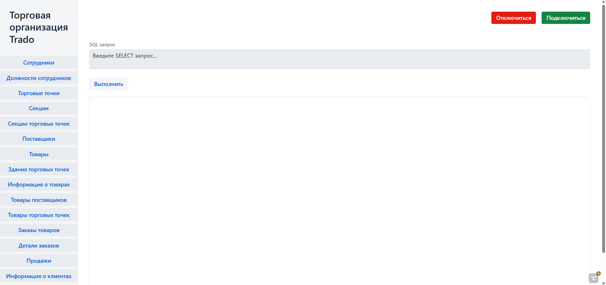

# 📊 Отчёт о выполнении задания 6

## 🌐 Обзор приложения

Веб-интерфейс для взаимодействия с реляционной базой данных с интуитивным UI и расширенным функционалом.

## 🛠 Ключевой функционал

### 🏠 Главное окно

#### 🔌 Управление подключением

| Элемент          | Функционал                                                               |
|------------------|--------------------------------------------------------------------------|
| **Подключиться** | Открывает форму авторизации (логин/пароль) для установки соединения с БД |
| **Отключиться**  | Разрывает активное соединение с базой данных                             |

#### 💻 SQL-интерфейс

- **Редактор запросов** с возможностью выполнения произвольных SQL-команд
- **Контекстное меню** (ПКМ) с подсказками и готовыми шаблонами запросов
- **Визуализация результатов** в табличном формате после выполнения

#### 🗂 Навигационная панель

- Древовидное отображение всех таблиц БД
- Быстрый переход к конкретной таблице (`/table_name`)

### 📑 Окно таблицы

**Интерактивное представление данных с расширенным управлением**

#### 🔙 Навигация

- Кнопка **«Назад»** для возврата на главную

#### 🎛 Панель инструментов

| Кнопка              | Назначение                                                       |
|---------------------|------------------------------------------------------------------|
| **Создать**         | Добавление новой записи через форму                              |
| **Создать фильтр**  | Настройка фильтрации данных                                      |
| **Очистить фильтр** | Сброс всех фильтров                                              |
| *Доп. кнопки*       | Контекстно-зависимые действия (генеруются для конкретных таблиц) |

#### 📊 Таблица данных

**Интерактивные возможности:**

- Сортировка по столбцам (↑/↓)
- **Контекстное меню** (ПКМ):
    - 👁 **Просмотр** - детализация записи
    - ✏️ **Редактирование** - изменение полей
    - ❌ **Удаление** - удаление записи (при наличии прав)
    - 🔗 **Переход по ссылке** - для Foreign Key (открывает связанную сущность)

## ⚙️ Техническая реализация

## 🔄 Взаимодействие с БД

- **Основной драйвер**: Всё взаимодействие осуществляется через **JDBC**
- **Пул соединений**: Используется высокопроизводительный **Hikari Pool** (5 соединений)
- **Авторизация**: Соединение устанавливается динамически после успешной аутентификации клиента
- **Безопасность**: При отключении все соединения гарантированно обрываются

## 💾 Исходный код

### 🛡️ `JdbcTemplateWrapper`

*Обёртка для безопасной работы с БД*

- Инкапсулирует `JdbcTemplate`
- Единая точка выполнения всех SQL-запросов

### 🏗️ `GenericRepository`

*Базовый класс для работы с данными*

- Автогенерация SQL-запросов
- Поддержка наследования для специализированных **View**

### 🏷️ Entities (POJO)

_Объектное представление таблиц_  
**Аннотации:**

| 🔖 Аннотация     | 📝 Назначение                  |
|------------------|--------------------------------|
| `@ColumnView`    | Метаданные столбца             |
| `@EnumColumn`    | Пометка для полей-перечислений |
| `@IdColumn`      | Идентификация первичного ключа |
| `@LinkTableView` | Описание Foreign Key связей    |
| `@TableView`     | Метаданные таблицы             |

## 🖥️ GUI составляющая

_Веб-интерфейс на Vaadin_

- **Генерация UI**: Автоматическая из Java-кода

- **Архитектура**:

    - `MainView`— главное окно

    - `DefaultTableView`— абстрактный родитель для всех таблиц

- **Динамические формы**:

    - Автоподбор полей ввода

    - Контекстно-зависимые элементы
