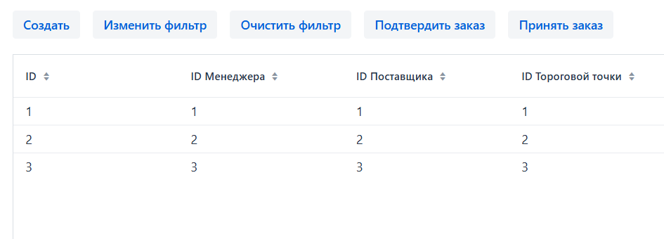

# ПРОДВИНУТОЕ ВЗАИМОДЕЙСТВИЕ С БАЗОЙ ДАННЫХ. КОНКУРЕНТНЫЙ ДОСТУП

## Ситуация №1

### Сценарий

- Пусть **Пользователь 1** и **Пользователь 2** начинают параллельно исполнять следующие шаги:

#### Пользователь 1:

1. Нажимает кнопку `Подтвердить заказ` во view `Заказы товаров`


2. Вызывается процедура `confirm_order(product_order_id)`
```java
public void confirmOrder(long id) {
    jdbcTemplateWrapper.consume(jdbcTemplate -> 
            jdbcTemplate.update("CALL confirm_order(?);", id)
    );
}
```

`confirm_order`:
```sql
CREATE OR REPLACE PROCEDURE confirm_order(order_id BIGINT)
AS $$
BEGIN
    UPDATE product_order
    SET confirm_date = NOW()
    WHERE id = order_id;

    IF NOT FOUND THEN
        RAISE EXCEPTION 'Заказ с ID % не найден', order_id;
    END IF;
END;
$$ LANGUAGE plpgsql;
```

3. UPDATE сущности `product_order` провоцирует вызов триггера `trg_product_order_status_changed`, после чего вызывается функция
`update_vendor_product`, который установит `vendor_id.reserved_by` при изменении статуса `product_order` на `CONFIRMED` ([см. SQL файл](../../database/scripts/migrations/V0004__constraints_and_triggers.sql))

`update_vendor_product`:
```sql
CREATE OR REPLACE FUNCTION update_vendor_product()
    RETURNS TRIGGER AS $$
BEGIN
    IF NEW.order_status = 'CONFIRMED' AND (OLD.order_status IS DISTINCT FROM NEW.order_status) THEN

        UPDATE vendor_product vp
        SET reserved_by = NEW.id
        FROM product_order_details pod
                 JOIN product_info pi ON pod.product_article = pi.product_article
        WHERE pod.product_order_id = NEW.id
          AND vp.product_info_id = pi.id
          AND vp.vendor_id = NEW.vendor_id
          AND vp.reserved_by IS NULL;

    END IF;

    RETURN NEW;
END;
$$ LANGUAGE plpgsql;
```

#### Пользователь 2:

1. Создаёт новый `product_order` и начинает добавлять конкретные товары в `product_order_details`.

2. При добавлении товара в заказ, база данных проверяет, что у поставщика X есть достаточное кол-во товара при помощи триггера `trg_check_vendor_product_availability`:

```sql
CREATE OR REPLACE FUNCTION check_vendor_product_availability()
    RETURNS TRIGGER AS
$$
DECLARE
    original_vendor_id   INTEGER;
    vendor_product_count INTEGER;
BEGIN
    IF (SELECT vendor_id INTO original_vendor_id FROM product_order WHERE id = NEW.product_order_id) IS NOT NULL THEN

        SELECT COUNT(*)
        INTO vendor_product_count
        FROM vendor_product
        WHERE vendor_product.reserved_by IS NULL
          AND vendor_id = original_vendor_id
          AND product_info_id = (SELECT id FROM product_info WHERE product_article = NEW.product_article);

        IF vendor_product_count < NEW.product_count THEN
            RAISE EXCEPTION 'Not enough products available from the vendor (Vendor ID: %, Product Article: %, Required: %, Available: %)',
                original_vendor_id,
                NEW.product_article,
                NEW.product_count,
                vendor_product_count;
        END IF;
    END IF;

    RETURN NEW;
END;
$$ LANGUAGE plpgsql;

CREATE TRIGGER trg_check_vendor_product_availability
    BEFORE INSERT OR UPDATE
    ON product_order_details
    FOR EACH ROW
EXECUTE FUNCTION check_vendor_product_availability();
```

### Проблема:

- Из-за параллельного доступа к колонке `vendor_product.reserved_by` **Пользователь 2** может, в теории, добавить в 
заказ товар, даже в случае, когда у поставщика его нет в наличии.
- Такая проблема называется **Lost update**.

### Решение:

- Достаточно будет блокировать **FOR UPDATE** строки `vendor_product.reserved_by` при обновлении.
- **НО** следуя документации [PostgreSQL](https://www.postgresql.org/docs/current/transaction-iso.html#XACT-SERIALIZABLE), было принято решение использовать тип изоляции **SERIALIZABLE**.
> Eliminate explicit locks, SELECT FOR UPDATE, and SELECT FOR SHARE where no longer needed due to the protections automatically provided by Serializable transactions.

- Т.е. достаточно изменить код из **"Пользователь 1"::п.2** на
```java
public void confirmOrder(long id) {
    jdbcTemplateWrapper.consume(jdbcTemplate ->
            jdbcTemplate.update(
                    """
                    BEGIN;
                    SET TRANSACTION ISOLATION LEVEL SERIALIZABLE;
                    CALL confirm_order(?);
                    COMMIT;""",
                    id
            )
    );
}
```
